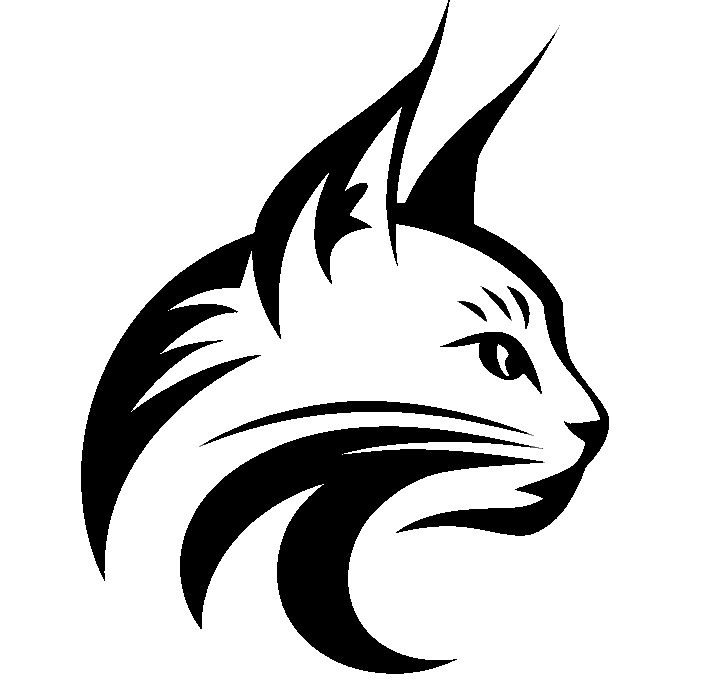
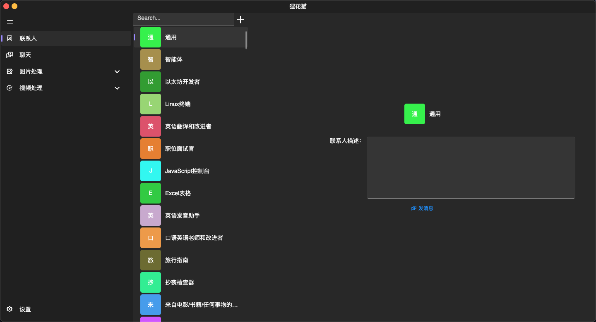
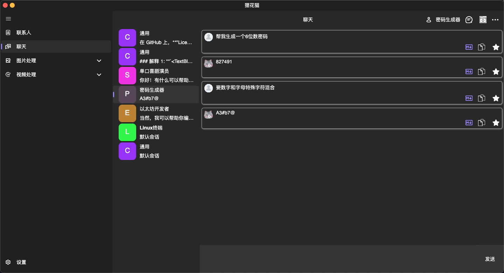
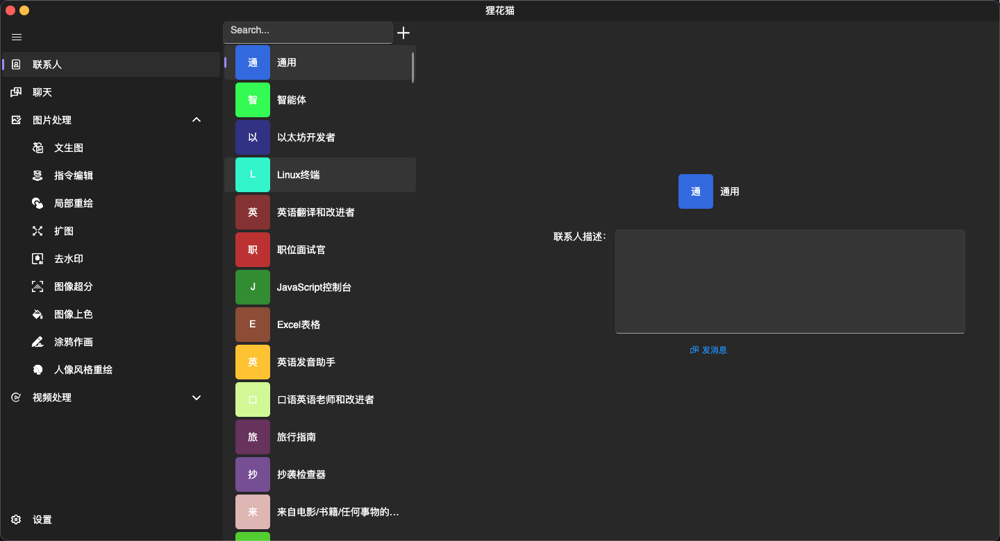
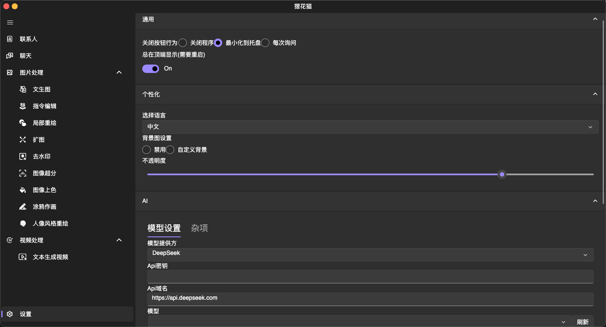
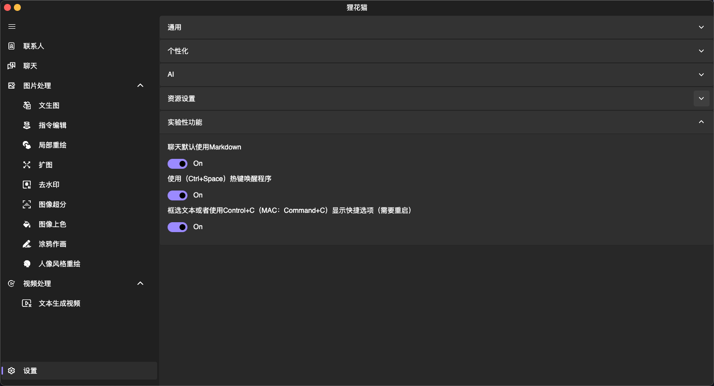

<!-- PROJECT LOGO -->
<br />
<div align="center">
  <a href="https://github.com/Snsaiu/TabbyCat_OpenSource">
    
  </a>

<h3 align="center">狸花猫-AI助手</h3>

  <p align="center">
    一款跨平台（MACOS，WINDOWS，LINUX）的AI聊天助手
    <br />
    <br />
    <a href="https://www.yyan.cc/product/tabbycat"><strong>直接到官网下载安装包</strong></a>
    <br />
    <br />
</div>


<!-- TABLE OF CONTENTS -->
<details>
  <summary>内容列表</summary>
  <ol>
    <li><a href="#界面概览">界面概览</a></li>
    <li>
      <a href="#关于项目">关于项目</a>
      <ul>
        <li><a href="#构建所用">构建所用</a></li>
      </ul>
    </li>
    <li>
      <a href="#开始项目">开始项目</a>
      <ul>
        <li><a href="#准备">准备</a></li>
        <li><a href="#安装">安装</a></li>
        <li><a href="#运行">运行</a></li>
      </ul>
    </li>
    <li><a href="#用法">用法</a></li>
    <li><a href="#开源许可">开源许可</a></li>
    <li><a href="#联系我们">联系我们</a></li>
  </ol>
</details>


## 界面概览

- 
- 
- 
- 
- 


<!-- ABOUT THE PROJECT -->
## 关于项目


这是一个基于 Avalonia 框架开发的跨平台 AI 助手应用。我们的目标是为用户提供一个功能强大、灵活易用的工具，无论您使用的是 Windows、macOS 还是 Linux，都可以无缝体验。
### 核心功能:
* 多角色支持：内置近 100+ 种角色，涵盖多种风格和场景，满足不同用户的需求。
* 无限会话模式：支持无限制的对话历史记录，确保每一次交流都流畅自然。
* 多媒体生成能力：
  * 支持**图片**生成与美化，帮助您轻松创作高质量的视觉内容。
  * 提供**视频**生成功能，让创意表达更加多样化。
* 跨平台兼容性：借助 Avalonia 框架，实现真正的跨平台运行，适配多种操作系统。
### 创建初衷
在当今数字化时代，AI 技术正在以前所未有的速度改变我们的生活和工作方式。然而，许多现有的 AI 工具往往受限于单一平台或功能不足。为了打破这些限制，我们决定开发这款跨平台的 AI 助手，旨在为用户提供一个功能全面、易于使用的解决方案。
通过 Avalonia 框架的强大支持，我们成功实现了跨平台的目标，同时保持了高性能和良好的用户体验。

### 未来展望
我们相信，AI 的潜力远不止于此。在未来，我们将继续优化现有功能，并探索更多创新的可能性，例如：
增加更多角色和定制化选项；
引入更先进的多媒体处理技术；
提升性能和稳定性，确保每一位用户都能获得最佳体验。
如果您对本项目感兴趣，欢迎 Star、Fork 或提交 Issue，一起参与这个激动人心的旅程！
希望这个版本能够更好地展示您的项目特点和价值！如果有其他需求或细节需要补充，请随时告诉我。

## 构建所用

本项目主要使用*Avalonia*和 *.NET 9* 以及*源代码生成器*

- <a href="https://github.com/AvaloniaUI/Avalonia">
    
  </a>

- <a href="https://github.com/dotnet/core">
    
  </a>
  
- <a href="https://github.com/dotnet/roslyn">
    
  </a>

<!-- GETTING STARTED -->
## 开始项目

### 准备

克隆项目

  ```sh
  git clone https://github.com/Snsaiu/TabbyCat_OpenSource.git
  ```

### 安装

1. 您可以安装**Rider**或者**Visual Studio 2022**。强烈建议您安装**Rider**。因为**Rider**的体验会更好！[详情查看](https://docs.avaloniaui.net/docs/get-started/set-up-an-editor)
2. 安装Avalonia UI模板 ```dotnet new install Avalonia.Templates```
3. 检查模板安装状态 ``` dotnet new list```
4. 如果出现一下内容表示安装成功 
```Template Name                                 Short Name                  Language    Tags
--------------------------------------------  --------------------------  ----------  ---------------------------------------------------------
Avalonia App                                  avalonia.app                [C#],F#     Desktop/Xaml/Avalonia/Windows/Linux/macOS
Avalonia MVVM App                             avalonia.mvvm               [C#],F#     Desktop/Xaml/Avalonia/Windows/Linux/macOS
Avalonia Cross Platform Application           avalonia.xplat              [C#],F#     Desktop/Xaml/Avalonia/Web/Mobile
Avalonia Resource Dictionary                  avalonia.resource                       Desktop/Xaml/Avalonia/Windows/Linux/macOS
Avalonia Styles                               avalonia.styles                         Desktop/Xaml/Avalonia/Windows/Linux/macOS
Avalonia TemplatedControl                     avalonia.templatedcontrol   [C#],F#     Desktop/Xaml/Avalonia/Windows/Linux/macOS
Avalonia UserControl                          avalonia.usercontrol        [C#],F#     Desktop/Xaml/Avalonia/Windows/Linux/macOS
Avalonia Window                               avalonia.window             [C#],F#     Desktop/Xaml/Avalonia/Windows/Linux/macOS 
```
### 运行
1. 打开项目并且编译
2. 选择 *TabbyCat.Desktop* 作为启动项目。
3. 运行

<!-- USAGE EXAMPLES -->
## 用法

具体的用法请查阅我们的[文档](https://github.com/Snsaiu/TabbyCat_OpenSource/wiki)

<!-- LICENSE -->
## 开源许可

关于开源许可 请查阅 `LICENSE`

<!-- CONTACT -->
## 联系我们

snsaiu@outlook.com

项目链接: [狸花猫](https://github.com/your_username/repo_name)


